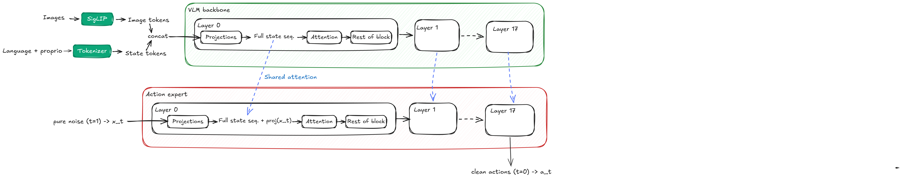
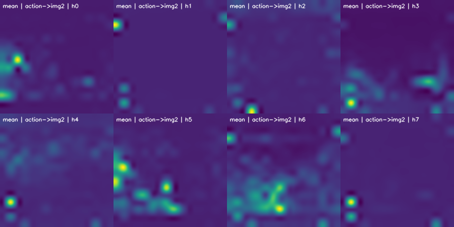
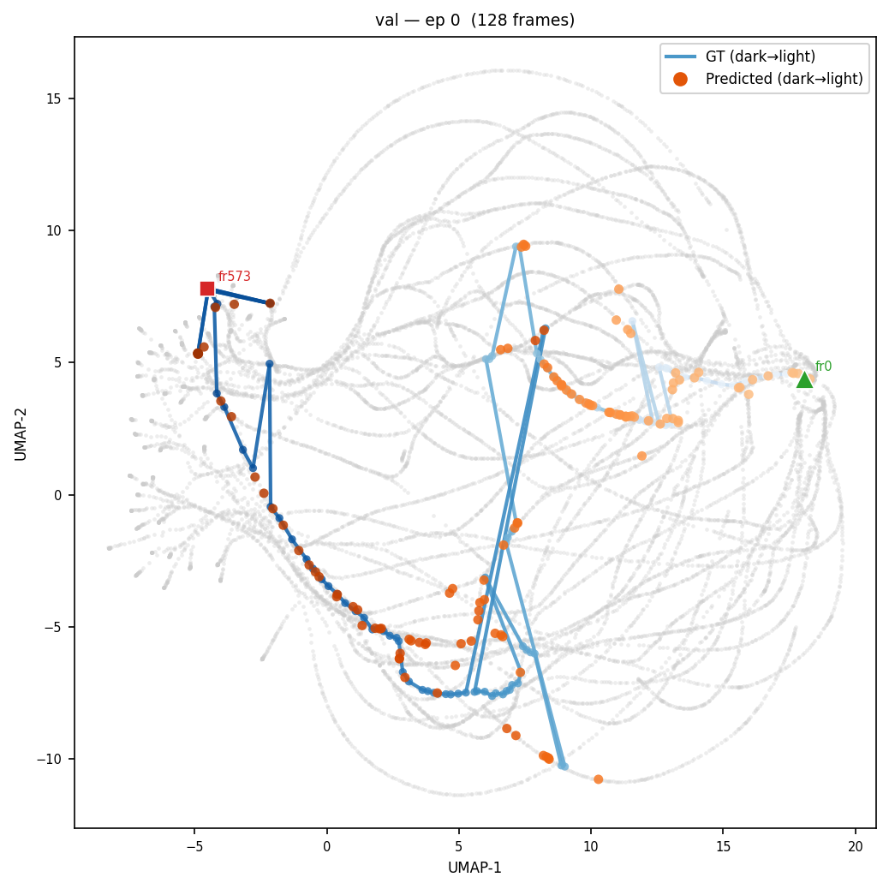
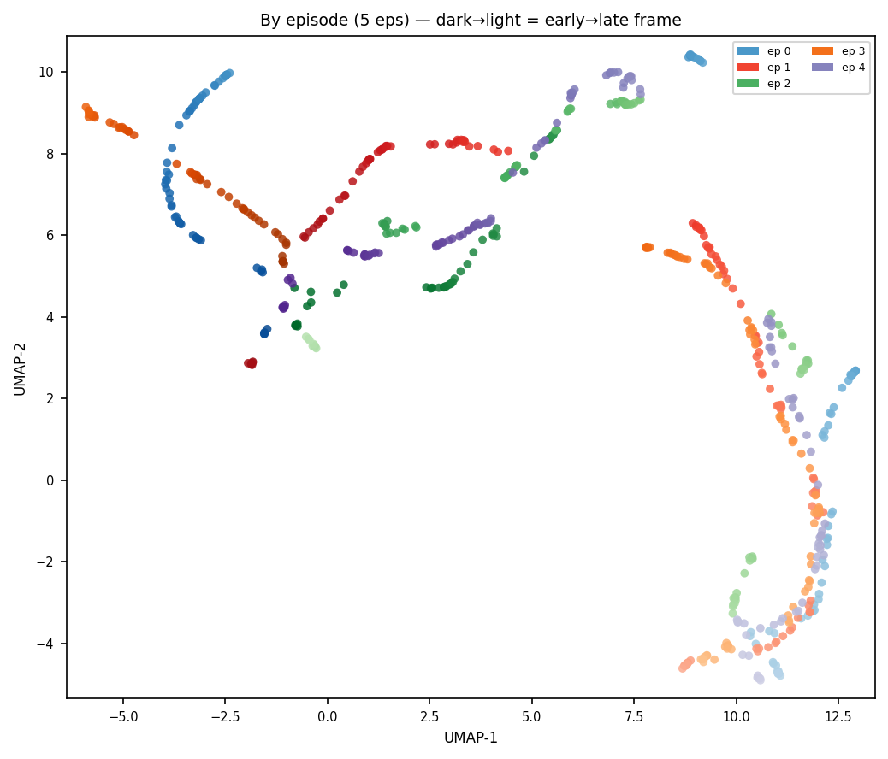
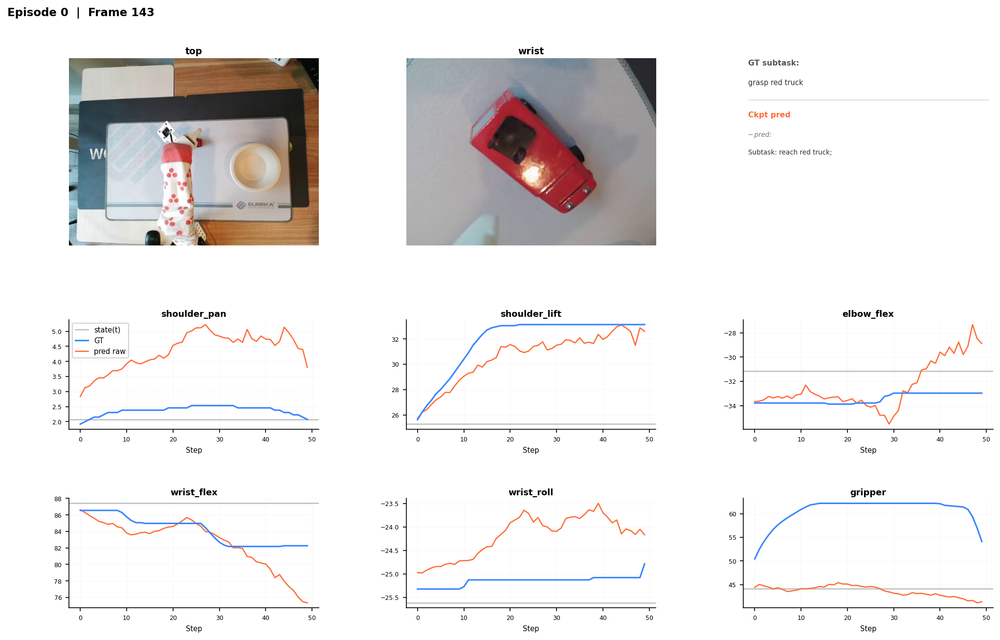

# Validation Metrics & Probes

This repo includes a suite of probes that automatically run during offline training or can be used as standalone scripts. All of them are configured via the `probe_parameters` section in the config file, and run at every validation step (`val_freq`). Results are logged to WandB and saved to `{output_dir}/validation/step_{N}/`.

To launch training with validation probes:

```bash
python -m lerobot.scripts.offline_learner_val_pi05 --config path/to/config.json
```

Additionally, we provide a tool for visualizing the results across training steps:

```bash
python -m lerobot.scripts.view_validation "path/to/output_dir"
```

<p align="center">
  <em>[PLACEHOLDER: screenshot of the view_validation Gradio interface]</em>
</p>

The following sections detail what each probe computes and the specific questions it addresses.


## $\pi_{0.5}$ architecture overview

$\pi_{0.5}$ processes images, language instructions, and proprioception using a backbone VLM, and the actions are generated by the action expert, which uses shared attention from the VLM sequences as illustrated below:


*$\pi_{0.5}$ architecture diagram*


## 1. Attention Maps

We compute the following attention maps from layer 0 across all images:
- **Actions**: highlights image regions targeted by action queries.
- **Language**: highlights image regions targeted by language queries.
- **Subtask**: highlights image regions targeted by subtask queries.
- **All**: the average of all attentions, including image-to-image interactions.

Attention maps are computed per head, with the final summary representing the average across all heads. The output of this probe is a video visualizing these maps over the validation set.

If the vision encoder or the first layer of the VLM is frozen, then the attention maps will not change during training.

<p align="center">
  
  <br>
  <em>Visualization of "all" attention heads for trained model.</em>
</p>

If the model is consistently not paying attention to the key objects in the scene, that means the weights have become corrupted and you should retrain the model. Just keep in mind that attention maps come with all sorts of artifacts.

### Standalone

```bash
python -m lerobot.rl.probe_attention_pi05 --config path/to/config.json
```

### Config

| Parameter | Default | Description |
|-----------|---------|-------------|
| `enable_attention` | `true` | Enable this probe |
| `timestep` | `0.5` | Diffusion timestep at which to capture attention |
| `attn_eval_subsample` | `2` | Sample every Nth frame |
| `attn_eval_episodes` | `null` | Specific episodes (null = all sampled) |

---

## 2. Spatial Memorization Probe

The computation here is the same as the attention maps, but now the idea is to compute them from random frames across different episodes and aggregate. Since the frames are all different, you would expect the aggregated maps to be roughly flat. However, if there is spatial memorization — e.g., the model learns the bowl is often in the lower right and just memorizes that — there will be patches of high attention persistent across frames.

This is what the attention looks like for a trained model:

<p align="center">
  
  <br>
  <em>Spatial memorization over actions.</em>
</p>

We do observe a degree of spatial memorization, and it is more pronounced in certain heads. This image in a vacuum is not very informative, but compared across checkpoints we can get a sense of how it evolves. The probe also reports a per-patch signal-to-noise ratio (mean attention divided by its standard deviation across frames): high SNR points to a memorized location, while low SNR points to dynamic, input-dependent attention.

### Standalone

```bash
python -m lerobot.rl.probe_attention_spatial_memorization --config path/to/config.json
```

### Config

| Parameter | Default | Description |
|-----------|---------|-------------|
| `enable_spatial_memorization` | `true` | Enable this probe |
| `spatial_layers` | `"0,9,17"` | Layers to analyze |
| `spatial_n_frames` | `32` | Number of frames to aggregate |

---

## 3. Action Drift Jacobian Probe

**What it does**: Uses gradient backpropagation to identify which image regions **causally influence** action generation, beyond just being attended to.

**Why it matters**: Attention shows where the model *looks*, but not whether those regions actually *matter* for the output. A head may attend strongly to a region that has zero effect on the predicted action. The Jacobian probe disentangles attention from causal influence.

### Computation

For a given input, run a forward pass with gradients enabled through the attention mechanism. Let $\mathbf{A} \in \mathbb{R}^{H \times S \times S}$ be the softmax attention weights and $\hat{\mathbf{a}}$ be the predicted action.

1. Compute a scalar loss: $\mathcal{L} = \|\hat{\mathbf{a}}\|_2$
2. Backpropagate: $\nabla_{\mathbf{A}} \mathcal{L}$
3. Compute the **causal map**:

$$\mathbf{C} = \mathbf{A} \odot |\nabla_{\mathbf{A}} \mathcal{L}|$$

**Interpretation**:
- $\mathbf{A}$: which patches are attended to (includes attention sinks that may not matter).
- $|\nabla_{\mathbf{A}} \mathcal{L}|$: how much a change in attention at each position would affect the action.
- $\mathbf{C} = \mathbf{A} \odot |\nabla_{\mathbf{A}} \mathcal{L}|$: patches that are **both** attended to **and** causally connected to the action output.

The probe also exposes a multi-layer variant (`jacobian_probe_forward_multilayer()`) that runs one forward+backward pass per layer, and a spatial-memorization variant that aggregates causal maps across frames the same way the spatial memorization probe does — revealing which memorized positions actively steer actions vs. those that are merely attended.

<p align="center">
  
  <br>
  <em>Action drift jacobian attention map. We can see the model is roughly learning to detect the bounding box of the truck.</em>
</p>

### Standalone

```bash
python -m lerobot.rl.probe_action_drift_jacobian --config path/to/config.json
```

### Config

| Parameter | Default | Description |
|-----------|---------|-------------|
| `enable_action_drift_jacobian` | `true` | Enable this probe |
| `enable_spatial_memorization_jacobian` | `false` | Enable spatial+Jacobian variant |
| `spatial_layers` | `"0,9,17"` | Layers for multi-layer analysis |

---

## 4. Action Manifold Probe

This probe checks whether predicted action chunks lie on the same manifold as the ground-truth actions. The motivation is that loss alone doesn't tell you if the model is generating plausible actions — a model can have low average loss but still produce action chunks that drift outside the distribution of physically meaningful motions.

The probe runs in two phases. **First**, at startup, it builds a reference manifold: ground-truth action chunks from the validation set are flattened, reduced with PCA (down to `action_pca_dims` components), and then UMAP'd to 2D and 3D. The PCA and UMAP transforms are **frozen** after this step so that any change in the embedding reflects changes in the model, not the projection.

**Second**, at every validation step, predicted and ground-truth actions are projected through the frozen transforms. For each predicted point, the probe finds its nearest neighbor in the reference set and reports the distance. The headline scalar logged to WandB is the ratio of the median predicted nearest-neighbor distance to the median ground-truth nearest-neighbor distance — a value near 1.0 means predictions sit on the manifold; much larger than 1.0 means they're drifting off it.

The probe also outputs a PCA scree plot, which is a useful sanity check on the intrinsic dimensionality of the action space.

<p align="center">
  
  <br>
  <em>Action manifold of root dataset (grey paths) and validation episode with ground truth and prediction projection. Red square is starting point and green triangle is end point Interestingly, the validation ground truth nor the prediction follow a smooth path in the root dataset manifold. Might be worth exploring further.</em>
</p>

### Outputs

| File | Description |
|------|-------------|
| `2d/trajectories.png` | GT paths + predicted points on reference manifold |
| `2d/by_frame.png` | Colored by frame index |
| `2d/by_subtask.png` | Colored by subtask label |
| `3d/by_episode.html` | Interactive 3D Plotly scatter |
| `nn_distances.csv` | Raw NN distance statistics |

### Standalone

```bash
python -m lerobot.rl.probe_actions_pi05 --config path/to/config.json
```

### Config

| Parameter | Default | Description |
|-----------|---------|-------------|
| `enable_actions` | `true` | Enable this probe |
| `action_pca_dims` | `50` | Number of PCA components |
| `ref_max_episodes` | `20` | Episodes used to build the reference manifold |
| `ref_n_frames_per_episode` | `256` | Frames per episode for reference |
| `umap_n_neighbors` | `15` | UMAP neighborhood size |
| `umap_min_dist` | `0.1` | UMAP minimum distance |

---

## 5. Representation Probe

This probe captures internal hidden states from two sites — the **prefix** (VLM, after processing images and language) and the **suffix** (action expert, at a chosen diffusion timestep) — and visualizes how those representations cluster. It's useful for catching cases where the model has collapsed to a generic representation, or for confirming that distinct subtasks actually live in distinct regions of the hidden space.

For each site, hidden states are mean-pooled over the relevant tokens and then passed through PCA and UMAP. Unlike the action manifold, here the PCA and UMAP are **re-fit at every validation step** — the goal is to track how the representation space itself evolves, not to compare against a fixed reference.

The probe optionally runs a **subtask injection** analysis: it does two forward passes for each frame, one with the ground-truth subtask tokens and one with the model's generated subtask tokens, and projects both into the same UMAP. The distance between the two reveals whether the model's subtask understanding is consistent with what it actually generates.

<p align="center">
  
  <br>
  <em>Representation UMAP colored by episode. Several episodes have similar representations. This can happen because 1. the model is memorizing, 2. the episodes are legitimately similar that a similar representation is reasonable. We suspect it's a combination of both.</em>
</p>

### Standalone

```bash
python -m lerobot.rl.probe_representations_pi05 --config path/to/config.json
```

### Config

| Parameter | Default | Description |
|-----------|---------|-------------|
| `enable_representations` | `true` | Enable this probe |
| `repr_pca_dims` | `100` | PCA components |
| `sites` | `"prefix,suffix"` | Which activation sites to probe |
| `subtask_injection` | `false` | Compare GT vs generated subtasks |
| `timestep` | `0.5` | Diffusion timestep for suffix capture |

---

## 6. Offline Inference Probe

The most direct measure of action prediction quality: this probe runs inference on sampled validation frames and reports the MSE between predicted and ground-truth action chunks. Flow-matching loss measures the velocity-field error during training, but MSE on the final denoised actions measures the actual output error the robot will experience.

Per-frame plots show predicted vs. GT action traces for each joint, in both unnormalized and normalized representations, which is the easiest way to spot systematic biases (a gripper that's always slightly closed, a joint that consistently lags, etc.). The `mean_mse` across all sampled frames is logged to WandB.

<p align="center">
  
  <br>
  <em>Predicted vs GT action traces for episode 0000 frame 0143.</em>
</p>

### Standalone

```bash
python -m lerobot.scripts.probe_offline_inference_pi05 --config path/to/config.json
```

### Config

| Parameter | Default | Description |
|-----------|---------|-------------|
| `enable_offline_eval` | `true` | Enable this probe |
| `offline_inference_n_frames` | `5` | Frames per episode |
| `max_episodes` | `5` | Episodes to evaluate |

---


