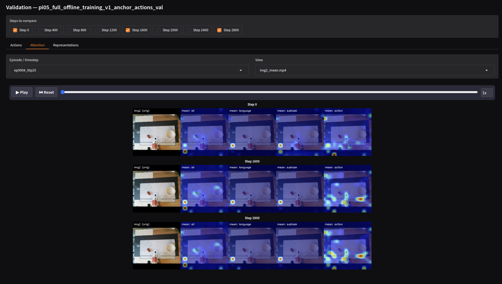

# Detailed Script Usage for RECAP

## Detailed Dataset Annotation

### Gemma vs Qwen (Automatic)
We provide scripts to leverage Vision Language Models like Qwen and Gemma to automatically annotate your trajectories. We've found that the Gemma-31B model tends to produce much more consistent subtask boundary detections.


*Example output of the visualization after offline evaluation.*

```bash
python -m lerobot.policies.pi05_full.annotate.gemma_subtask_annotate \
    --data-dir data/my_robot_dataset \
    --output-dir data/my_robot_dataset_annotated
```

### Manual Annotation
For higher quality or edge cases, you can manually annotate using the generic annotation UI. Launch the UI using:
```bash
python -m lerobot.policies.pi05_full.annotate.manual_subtask_annotate
```

## Phase 1: Offline Training in Detail

> [!WARNING]  
> **Important:** You must ensure your dataset is properly chunked before proceeding with offline distillation. Improper chunking will lead to severe distribution shifts!

<details>
<summary><b>Click to expand hyperparameter options</b></summary>

| Parameter | Type | Default | Description |
|-----------|------|---------|-------------|
| `batch_size` | Int | 64 | The number of sequences per batch |
| `learning_rate` | Float | 3e-4 | Peak learning rate for the schedule |
| `offline_steps` | Int | 10000 | Number of steps for Phase 1 |
| `weight_decay` | Float | 1e-4 | L2 regularization to prevent overfitting |

</details>

## Phase 2: Online Training and Actor setup
This phase requires two separate processes executing over RPC.

## Interventions and Live Inference Setup
Press `5` on the leader arm to intervene!

## Detailed Validation & Offline Evaulation

## Iterative Loop Workflows
