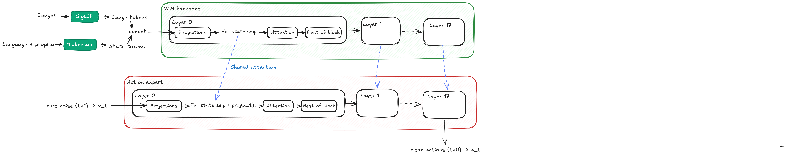
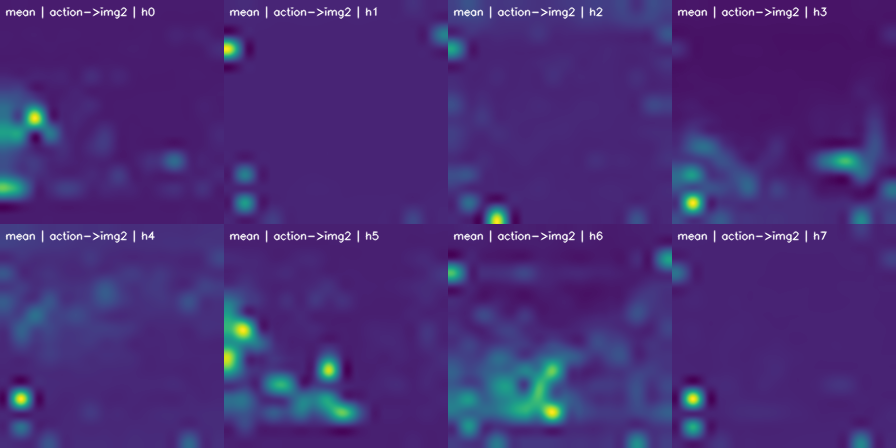
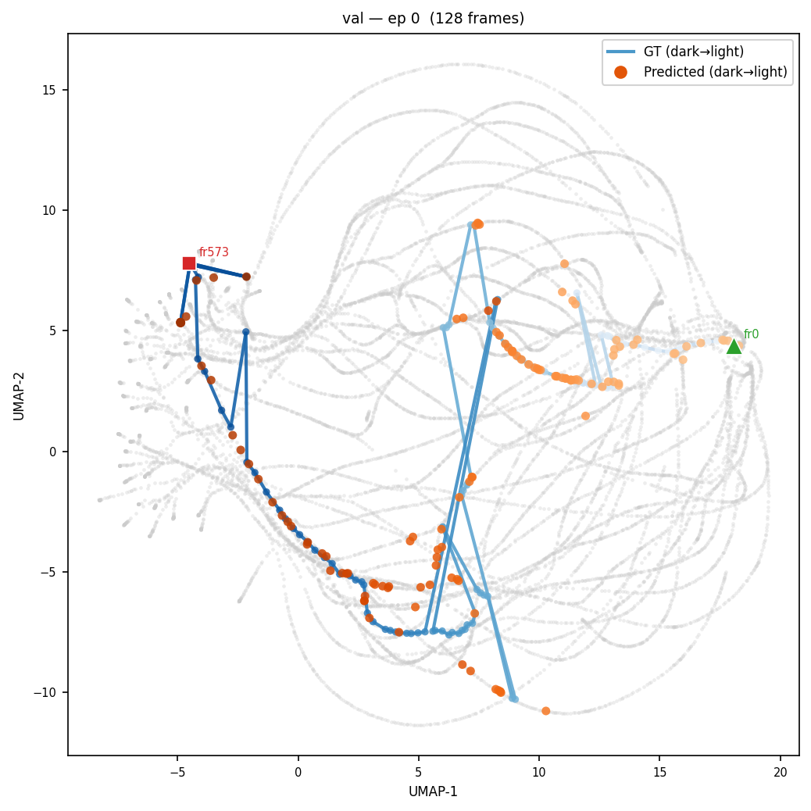
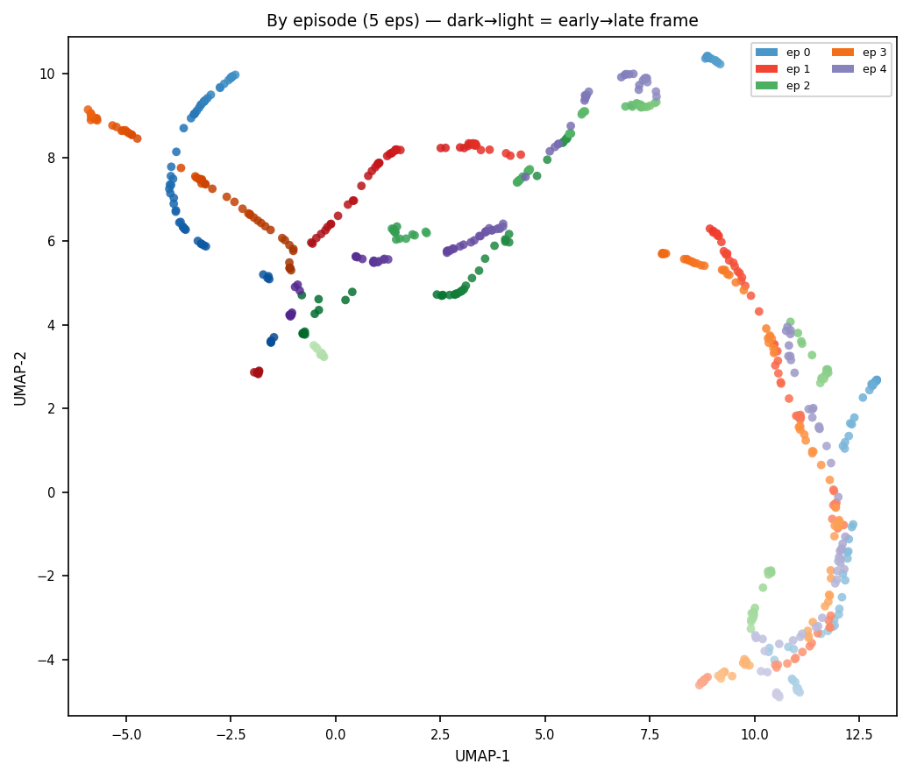

# Validation Metrics & Probes

This repo includes a suite of probes that automatically run during offline training or can be used as standalone scripts. All of them are configured via the `probe_parameters` section in the config file, and run at every validation step (`val_freq`). Results are logged to WandB and saved to `{output_dir}/validation/step_{N}/`.

To launch training with validation probes:

```bash
python -m lerobot.scripts.rl_offline --config path/to/config.yaml
```

Additionally, we provide a tool for visualizing the results across training steps:

```bash
python -m lerobot.scripts.view_probes "path/to/output_dir"
```

It serves a browser UI on `http://127.0.0.1:7870` and re-scans `<run>/validation/step_*/<probe>/` on every request, so a checkpoint that lands mid-session appears on refresh. Each probe describes itself to the viewer through the `index.json` it writes (`probes/manifest.py`), so its documentation, headline numbers, and per-figure captions live next to the code that produces them.

The following sections detail what each probe computes and the specific questions it addresses.


## $\pi_{0.5}$ architecture overview

$\pi_{0.5}$ processes images, language instructions, and proprioception using a backbone VLM, and the actions are generated by the action expert, which uses shared attention from the VLM sequences as illustrated below:


*$\pi_{0.5}$ architecture diagram*


## 1. Attention Maps

We compute the following attention maps from layer 0 across all images:
- **Actions**: highlights image regions targeted by action queries.
- **Language**: highlights image regions targeted by language queries.
- **Subtask**: highlights image regions targeted by subtask queries.
- **All**: the average of all attentions, including image-to-image interactions.

Attention maps are computed per head, with the final summary representing the average across all heads. The output of this probe is a video visualizing these maps over the validation set.

If the vision encoder or the first layer of the VLM is frozen, then the attention maps will not change during training.

<p align="center">
  
  <br>
  <em>Visualization of "all" attention heads for trained model.</em>
</p>

If the model is consistently not paying attention to the key objects in the scene, that means the weights have become corrupted and you should retrain the model. Just keep in mind that attention maps come with all sorts of artifacts.

### Standalone

```bash
python -m lerobot.probes.attention --config path/to/config.yaml
```

### Config

| Parameter | Default | Description |
|-----------|---------|-------------|
| `enable_attention` | `true` | Enable this probe |
| `timestep` | `0.5` | Diffusion timestep at which to capture attention |
| `attn_eval_subsample` | `2` | Sample every Nth frame |
| `attn_eval_episodes` | `null` | Specific episodes (null = all sampled) |

---

## 2. Spatial Memorization Probe

The computation here is the same as the attention maps, but now the idea is to compute them from random frames across different episodes and aggregate. Since the frames are all different, you would expect the aggregated maps to be roughly flat. However, if there is spatial memorization — e.g., the model learns the bowl is often in the lower right and just memorizes that — there will be patches of high attention persistent across frames.

This is what the attention looks like for a trained model:

<p align="center">
  
  <br>
  <em>Spatial memorization over actions.</em>
</p>

We do observe a degree of spatial memorization, and it is more pronounced in certain heads. This image in a vacuum is not very informative, but compared across checkpoints we can get a sense of how it evolves. The probe also reports a per-patch signal-to-noise ratio (mean attention divided by its standard deviation across frames): high SNR points to a memorized location, while low SNR points to dynamic, input-dependent attention.

### Standalone

```bash
python -m lerobot.probes.spatial_memorization_attention --config path/to/config.yaml
```

### Config

| Parameter | Default | Description |
|-----------|---------|-------------|
| `enable_spatial_memorization` | `true` | Enable this probe |
| `spatial_layers` | `"0,9,17"` | Layers to analyze |
| `spatial_n_frames` | `32` | Number of frames to aggregate |

---

## 3. Action Drift Jacobian Probe

**What it does**: Uses gradient backpropagation to identify which image regions **causally influence** action generation, beyond just being attended to.

**Why it matters**: Attention shows where the model *looks*, but not whether those regions actually *matter* for the output. A head may attend strongly to a region that has zero effect on the predicted action. The Jacobian probe disentangles attention from causal influence.

### Computation

For a given input, run a forward pass with gradients enabled through the attention mechanism. Let $\mathbf{A} \in \mathbb{R}^{H \times S \times S}$ be the softmax attention weights and $\hat{\mathbf{a}}$ be the predicted action.

1. Compute a scalar loss: $\mathcal{L} = \|\hat{\mathbf{a}}\|_2$
2. Backpropagate: $\nabla_{\mathbf{A}} \mathcal{L}$
3. Compute the **causal map**:

$$\mathbf{C} = \mathbf{A} \odot |\nabla_{\mathbf{A}} \mathcal{L}|$$

**Interpretation**:
- $\mathbf{A}$: which patches are attended to (includes attention sinks that may not matter).
- $|\nabla_{\mathbf{A}} \mathcal{L}|$: how much a change in attention at each position would affect the action.
- $\mathbf{C} = \mathbf{A} \odot |\nabla_{\mathbf{A}} \mathcal{L}|$: patches that are **both** attended to **and** causally connected to the action output.

The probe also exposes a multi-layer variant (`jacobian_probe_forward_multilayer()`) that runs one forward+backward pass per layer, and a spatial-memorization variant that aggregates causal maps across frames the same way the spatial memorization probe does — revealing which memorized positions actively steer actions vs. those that are merely attended.

<p align="center">
  
  <br>
  <em>Action drift jacobian attention map. We can see the model is roughly learning to detect the bounding box of the truck.</em>
</p>

### Standalone

```bash
python -m lerobot.probes.action_drift_jacobian --config path/to/config.yaml
```

### Config

| Parameter | Default | Description |
|-----------|---------|-------------|
| `enable_action_drift_jacobian` | `true` | Enable this probe |
| `enable_spatial_memorization_jacobian` | `false` | Enable spatial+Jacobian variant |
| `spatial_layers` | `"0,9,17"` | Layers for multi-layer analysis |

---

## 4. Action Manifold Probe

This probe checks whether predicted action chunks lie on the same manifold as the ground-truth actions. The motivation is that loss alone doesn't tell you if the model is generating plausible actions — a model can have low average loss but still produce action chunks that drift outside the distribution of physically meaningful motions.

The probe runs in two phases. **First**, at startup, it builds a reference manifold: ground-truth action chunks from the validation set are flattened, reduced with PCA (down to `action_pca_dims` components), and then UMAP'd to 2D and 3D. The PCA and UMAP transforms are **frozen** after this step so that any change in the embedding reflects changes in the model, not the projection.

**Second**, at every validation step, predicted and ground-truth actions are projected through the frozen transforms. For each predicted point, the probe finds its nearest neighbor in the reference set and reports the distance. The headline scalar logged to WandB is the ratio of the median predicted nearest-neighbor distance to the median ground-truth nearest-neighbor distance — a value near 1.0 means predictions sit on the manifold; much larger than 1.0 means they're drifting off it.

The probe also outputs a PCA scree plot, which is a useful sanity check on the intrinsic dimensionality of the action space.

<p align="center">
  
  <br>
  <em>Action manifold of root dataset (grey paths) and validation episode with ground truth and prediction projection. Red square is starting point and green triangle is end point Interestingly, the validation ground truth nor the prediction follow a smooth path in the root dataset manifold. Might be worth exploring further.</em>
</p>

### Outputs

| File | Description |
|------|-------------|
| `2d/trajectories.png` | GT paths + predicted points on reference manifold |
| `2d/by_frame.png` | Colored by frame index |
| `2d/by_subtask.png` | Colored by subtask label |
| `3d/by_episode.html` | Interactive 3D Plotly scatter |
| `nn_distances.csv` | Raw NN distance statistics |

### Standalone

```bash
python -m lerobot.probes.actions --config path/to/config.yaml
```

### Config

| Parameter | Default | Description |
|-----------|---------|-------------|
| `enable_actions` | `true` | Enable this probe |
| `action_pca_dims` | `50` | Number of PCA components |
| `ref_max_episodes` | `20` | Episodes used to build the reference manifold |
| `ref_n_frames_per_episode` | `256` | Frames per episode for reference |
| `umap_n_neighbors` | `15` | UMAP neighborhood size |
| `umap_min_dist` | `0.1` | UMAP minimum distance |

---

## 5. Representation Probe

This probe captures internal hidden states from two sites — the **prefix** (VLM, after processing images and language) and the **suffix** (action expert, at a chosen diffusion timestep) — and visualizes how those representations cluster. It's useful for catching cases where the model has collapsed to a generic representation, or for confirming that distinct subtasks actually live in distinct regions of the hidden space.

For each site, hidden states are mean-pooled over the relevant tokens and then passed through PCA and UMAP. Unlike the action manifold, here the PCA and UMAP are **re-fit at every validation step** — the goal is to track how the representation space itself evolves, not to compare against a fixed reference.

The probe optionally runs a **subtask injection** analysis: it does two forward passes for each frame, one with the ground-truth subtask tokens and one with the model's generated subtask tokens, and projects both into the same UMAP. The distance between the two reveals whether the model's subtask understanding is consistent with what it actually generates.

<p align="center">
  
  <br>
  <em>Representation UMAP colored by episode. Several episodes have similar representations. This can happen because 1. the model is memorizing, 2. the episodes are legitimately similar that a similar representation is reasonable. We suspect it's a combination of both.</em>
</p>

### Standalone

```bash
python -m lerobot.probes.representations --config path/to/config.yaml
```

### Config

| Parameter | Default | Description |
|-----------|---------|-------------|
| `enable_representations` | `true` | Enable this probe |
| `repr_pca_dims` | `100` | PCA components |
| `sites` | `"prefix,suffix"` | Which activation sites to probe |
| `subtask_injection` | `false` | Compare GT vs generated subtasks |
| `timestep` | `0.5` | Diffusion timestep for suffix capture |

---

## 6. Action Inspector

The most direct measure of action prediction quality, and the probe that answers "is this checkpoint any good". At anchor frames spaced through the validation episodes it draws `trace_n_samples` flow samples of the action chunk and reports two independent readouts.

**Baseline-relative fit.** MSE between flow sample 0 and the demonstrated chunk, in the normalized model space the policy trains in. Flow-matching loss measures the velocity-field error during training; this measures the output error the robot experiences. The absolute number means nothing on its own, so it sits next to the two constant predictors it has to beat — repeating the measured pose for the whole chunk (`baseline_hold`), and the mean demonstrated chunk over the anchors (`baseline_dataset_mean`). `skill_vs_hold` and `skill_vs_mean` are the fraction of each baseline's error the policy removes; at or below zero the policy is not predicting. The per-joint split in `action_metrics.json` is where systematic bias shows up (a gripper that is always slightly closed, a joint that consistently lags).

**Task-space geometry.** The chunk is put through the reBot URDF, giving a table-clearance pre-flight check from per-link convex hulls, the multimodality fan across samples, and Cartesian error against GT. All of it is open-loop: every anchor restarts from a demonstrated state, so compounding error and recovery are invisible by construction, and Cartesian divergence from GT is not automatically error on a multimodal task.

Output is one interactive Plotly page (`action_trace.html`) plus `metrics.csv`, `action_metrics.json`, and — on an `action_mode=both` checkpoint — a scale-locked FAST-vs-flow scene in `decoder_comparison.html`.

### Standalone

```bash
python -m lerobot.probes.action_trace_probe --config path/to/config.yaml
```

### Config

| Parameter | Default | Description |
|-----------|---------|-------------|
| `enable_action_trace` | `false` | Enable this probe |
| `trace_anchor_stride_s` | `2.0` | Seconds between anchor frames |
| `trace_max_anchors_per_episode` | `30` | Per-episode anchor cap |
| `trace_n_samples` | `5` | Independent flow draws per anchor (the fan) |
| `trace_clearance_warn_m` | `0.01` | Samples dipping below this are drawn red |

---

## 7. Spatial Memorization (Causal Jacobian Variant)

A variant of the spatial memorization probe (Section 2) that aggregates **causal** attention maps $\mathbf{A} \odot |\nabla_{\mathbf{A}} \mathcal{L}|$ instead of raw softmax attention $\mathbf{A}$. It reuses the same frame-sampling and rendering pipeline as Section 2, but asks the policy adapter for `capture_attention(..., requires_grad=True)` so that a backward pass through the attention weights is included.

Use this when the raw-attention spatial memorization map (Section 2) shows a persistent hot spot and you want to know whether that hot spot actually drives the action output, or whether it is an attention-only artifact uncorrelated with the policy's decisions.

Output directory: `{output_dir}/spatial_memorization_action_jacobian/`.

### Standalone

```bash
python -m lerobot.probes.spatial_memorization_action_jacobian --config path/to/config.yaml
```

### Config

| Parameter | Default | Description |
|-----------|---------|-------------|
| `enable_spatial_memorization_jacobian` | `false` | Enable this probe (off by default — requires a backward pass per sampled frame) |
| `spatial_layers` | `"0,9,17"` | Layers to analyze |
| `spatial_n_frames` | `32` | Number of frames to aggregate |

---

## 8. Critic Values Distribution

When the distributional critic is enabled (`skip_critic: false`), this probe samples validation frames and characterizes the critic's output. It is policy-agnostic — it works against any policy whose `ProbablePolicy` adapter implements `predict_value` and `predict_value_and_probs`. Adapters that additionally implement `value_gradient_magnitude` get the gradient-based plots and percentile-exemplar frames; otherwise those sections are skipped.

Outputs (under `{output_dir}/critic/`):

| File | Description |
|------|-------------|
| `predicted_distributions.png` | Per-frame $P(V)$ curves with $\mathbb{E}[V]$ overlay |
| `advantage_dist.png` | TD-error histogram + CDF + by-subtask boxplot |
| `advantage_squashed_dist.png` | $\tanh(\text{TD-error}/\text{scaling})$ version of the above |
| `gradient_magnitudes.png` | $\|\nabla_\text{vision} V\|$ distribution (only when the adapter supports it) |
| `frame_p{XX}.png` | Percentile-exemplar frames at $V$ deciles (only when the adapter supports it) |

The probe is a no-op when `skip_critic: true` (the policy has no critic head to query).

### Standalone

```bash
python -m lerobot.probes.critic --config path/to/config.yaml
```

### Config

| Parameter | Default | Description |
|-----------|---------|-------------|
| `enable_critic_values_distribution` | `false` | Enable this probe (off by default — requires backward when the gradient sections are active) |
| `critic_adv_frames` | `1000` | Frames sampled for $V(s)$ / TD-error distributions |
| `critic_grad_frames` | `200` | Frames sampled for $\|\nabla_\text{vision} V\|$ (forward + backward) |

---

## 9. MEM History Influence

**What it does**: Measures how much the short-term memory (the MEM video encoder over past frames + the continuous proprio-history tokens, see [`04_memory.md` §2.4](../../pi07_wiki/04_memory.md)) actually shifts the policy's predicted action chunk.

**Why it matters**: The memory path adds parameters and tokens, but that is worthless if the model ignores them. A dead memory feature reads ~0 here; a working one moves the actions, and — the causal-confusion question — the movement should track training. Because the MEM encoder has **no gate** (unlike the depth read), history influences the output from step 0 with pretrained attention weights, so the signal to watch is the *trend* and the *per-channel split*, not the raw magnitude.

### Computation

The memory is not sampled or synthesized — it is the frame's **actual observed past**. For a probe frame at global index $g$ (episode start $g_0$), the lookback window is the real frames at offsets $[150,120,90,60,30]$ steps (5→1 s ago at 30 fps), oldest → newest, repeat-padded to $g_0$ on underflow (the buffer's π0.7 pad rule):

$$V = (I_{g-150},\dots,I_{g-30})\ \text{per camera}, \qquad S = (s_{g-150},\dots,s_{g-30}).$$

The four **conditions** are not different memories — they are the *same* memory $m=(V,S)$ selectively revealed by two binary gates applied at the model input (the token sequence, and hence its length and positions, is identical across all four; only content is gated):

- $u\in\{0,1\}$ — image history, via `history_images_mask`. $u=0$ masks the past-frame temporal-attention keys to $-\infty$, so the ViT computes the exact single-frame (K=1) encoding; $u=1$ enables full temporal attention over $V$.
- $w\in\{0,1\}$ — state history, via presence of `history_state_values`. $w=0$ skips the scatter (placeholders keep their base reserved-token embedding); $w=1$ adds the projected states $W s_{g-k}+b$.

The flow head is deterministic once its noise is fixed. With a fixed seed $\epsilon$ (a fresh generator seeded identically before each call; CUDA graphs off for eager determinism), let

$$a^{(u,w)} = \pi_\theta\big(o_g,\ \tau,\ m;\ u,\ w,\ \epsilon\big)\ \in\ \mathbb{R}^{H\times d}, \qquad H=50,\ d=7$$

be the **normalized** action chunk (q01/q99 space, $\approx[-1,1]$ per joint). Per frame, against the memoryless baseline $a^{(0,0)}$:

$$\mathrm{RMSE}_c=\sqrt{\frac{1}{Hd}\sum_{t,j}\big(a^{(c)}_{t,j}-a^{(0,0)}_{t,j}\big)^2}, \qquad \mathrm{max}_c=\max_{t,j}\big|a^{(c)}_{t,j}-a^{(0,0)}_{t,j}\big|$$

for the three conditions $c\in\{\text{full}=(1,1),\ \text{images}=(1,0),\ \text{states}=(0,1)\}$, reported as the mean over probe frames. This is a **discrete causal intervention** — the finite-difference analog of $\lVert\partial a/\partial m\rVert$ — holding frame, task, noise, and weights fixed, so the delta is attributable solely to the gated memory. Three deliberate choices:

- **Same $\epsilon$ across conditions** isolates conditioning from flow stochasticity; a varying seed would measure noise variance instead.
- **$a^{(0,0)}$ as the anchor** makes this a within-model sensitivity (same $\theta$, memory gated off), not a model-vs-model gap.
- **No additivity is assumed**: $\mathrm{influence}_\text{images}+\mathrm{influence}_\text{states}\neq\mathrm{influence}_\text{full}$ in general, because the two channels interact through the shared LLM — so `full` is measured directly, never summed.

**Interpretation**: `full` is total memory influence; `images` / `states` isolate each channel. `images`≈0 while `states` moves (or vice versa) flags a dead channel. A value that stays flat *and* buys no loss improvement from memory is the causal-confusion signal — memory present but unused.

### Outputs

| File | Description |
|------|-------------|
| `influence.json` | Per-frame and mean RMSE / max-\|Δ\| for full / images / states |
| `influence.png` | Bar chart of the mean per-channel action Δ vs no-memory |

Registered probe only (runs at each validation step; no standalone CLI). Skips itself when no short-term memory is configured or `action_mode: discrete`.

### Config

| Parameter | Default | Description |
|-----------|---------|-------------|
| `enable_mem_history_influence` | `false` | Enable this probe |
| `n_frames_per_episode` | `128` | Frames measured per episode (× 4 forwards each — heavy; lower for quick loops) |
| `max_episodes` | `5` | Episodes sampled |
| `random_seed` | `42` | Frame-sampling seed |

---

## 10. MEM Temporal Attention Mass

**What it does**: For each temporal layer of the MEM video encoder, measures what fraction of the **current frame's** attention mass lands on **past frames** (rather than on its own frame's patches).

**Why it matters**: This is the mechanism-level read on whether the temporal path engages at all, and at what depth. Probe 9 asks "does memory change the output"; this asks "is the encoder actually looking at the past" — a temporal mass pinned at the uniform floor means the past keys are being ignored regardless of what the downstream action does.

### Computation

The MEM encoder makes every $\text{temporal\_layer\_stride}$-th ViT layer attend, per patch, over a union of keys: its own frame's $n=729$ patches plus the *same patch position* in each strictly-older frame (causal), all in one softmax ([`04_memory.md` §2.4](../../pi07_wiki/04_memory.md)). With $T$ frames in the window (here $T=6$: 5 past + current) and softmax weights $\alpha^{(\ell)}_{h,i}(\cdot)$, the temporal mass of the current-frame query at patch $i$, head $h$, layer $\ell$ is the weight on its $T-1$ past keys:

$$\mu^{(\ell)}_{h,i}=\sum_{t'=0}^{T-2}\alpha^{(\ell)}_{h,i}\big(\text{patch }i\text{ of frame }t'\big)\ \in [0,1].$$

The probe records the mean over batch, heads, and patches, one scalar per temporal layer, averaged over frames:

$$\bar\mu^{(\ell)}=\frac{1}{B\,H\,n}\sum_{b,h,i}\mu^{(\ell)}_{b,h,i}.$$

**Interpretation**: read $\bar\mu^{(\ell)}$ against the **uniform baseline** $\tfrac{T-1}{\,n+T-1\,}=\tfrac{5}{734}\approx 0.0068$ — the mass a query would place on the past if attention were flat over all keys. Near that floor means no preferential use of history; well above it means the current frame is actively pulling from the past at that depth. Rising values over training (and which layers rise) show the mechanism waking up.

### Outputs

| File | Description |
|------|-------------|
| `temporal_attention.json` | Per-layer mean ± std temporal mass |
| `temporal_attention.png` | Bar chart of past-frame attention mass by ViT temporal layer |

Registered probe only (runs at each validation step; no standalone CLI). Implemented via a zero-overhead capture hook in `_temporal_vision_block` (`_MEM_TEMPORAL_CAPTURE`, no-op when disabled). Skips itself when no image history is configured.

### Config

| Parameter | Default | Description |
|-----------|---------|-------------|
| `enable_mem_temporal_attention` | `false` | Enable this probe |
| `n_frames_per_episode` | `128` | Frames measured per episode (one prefix forward each) |
| `max_episodes` | `5` | Episodes sampled |
| `random_seed` | `42` | Frame-sampling seed |

---
