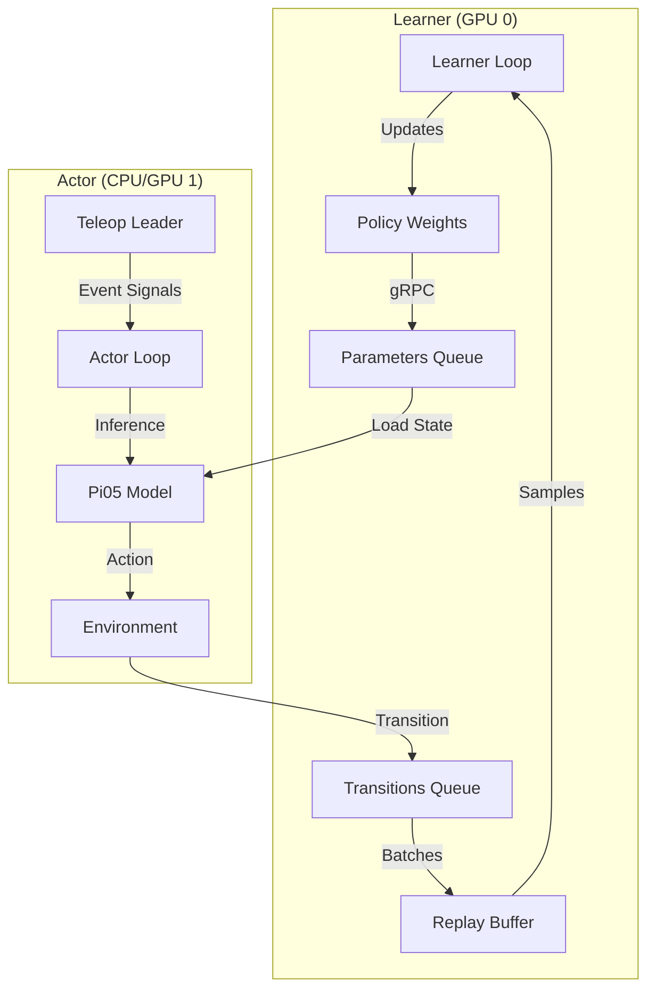

# Pi05 Technical Analysis

This document provides a rigorous analysis of the Pi05 algorithm and its implementation within LeRobot. It details the distributed architecture, mathematical formulation of the learning objective, and specific mechanisms used for high-throughput training.

## 1. Mathematical Formulation

The system fine-tunes a Vision-Language-Action (VLA) model $\pi_\theta$ using a hybrid objective that combines Reinforcement Learning with auxiliary classification losses.

### Learning Objective
The total loss function $L_{total}$ minimized at each step $t$ is defined as:

$$
L_{total}(\theta) = \underbrace{\lambda_{flow} \cdot \mathbb{E}_{\tau} [ || u_t - v_t(\phi(s_t, z_l), a_t) ||^2 ]}_{\text{Flow Matching Loss}} + \underbrace{\lambda_{action} \cdot L_{CE}(\pi_\theta)}_{\text{Action Token Loss}} + \underbrace{\lambda_{subtask} \cdot L_{CE}(\pi_\theta)}_{\text{Subtask Loss}}
$$

Where:
-   $u_t$: The target flow vector field.
-   $v_t$: The model's predicted vector field given state embedding $\phi(s_t, z_l)$ and action $a_t$.
-   $L_{CE}$: Cross-entropy loss for discrete token predictions (if applicable).

### Advantage Weighted Regression
The policy update is modulated by an Advantage estimate $A(s,a)$, computed as:

$$
A(s_t, a_t) = \begin{cases} 
1.0 & \text{if } I_{human}(t) \\
r_t + \gamma V_\psi(s_{t+1}) - V_\psi(s_t) & \text{otherwise}
\end{cases}
$$

-   **Human-Gated RL**: The term $I_{human}(t)$ acts as a hard override. When a human intervenes (teleoperation), the system assigns maximal advantage ($1.0$), treating the intervention as an optimal demonstration regardless of the critic's estimate.
-   **Critic**: $V_\psi$ is a separate value function parameterized by $\psi$.

---

## 2. Distributed System Architecture

The training infrastructure implements a **Parameter Server** pattern to decouple the high-latency rendering/simulation loop (Actor) from the high-throughput optimization loop (Learner).



### Component Analysis

#### The Learner (`learner_pi05.py`)
Acts as the authoritative source of truth for weights $\theta$ and $\psi$.
-   **Inbound Data**: Consumes serialised `Transition` objects from `transitions_queue`.
-   **Optimization**: Executes `pi05_update_step` (detailed in Section 4).
-   **Synchronization**: Pushes updated state dicts to `parameters_queue` every `policy_update_freq`.

#### The Actor (`actor_pi05.py`)
A rollout worker that operates in `eval` mode.
-   **Policy Sync**: The function `update_policy_parameters` (Line 571) fetches the latest byte-stream from the learner and loads it via `policy.load_state_dict`.
-   **Event Handling**: Maps hardware signals (e.g., Key '5' on So-Leader) to semantic `TeleopEvents`, which are injected into the transition's `complementary_info`.

---

## 3. Critic Architecture (`rl_pi05.py`)

To estimate $V_\psi(s)$, we employ a specialized architecture designed to prevent representation collapse in the shared vision encoder.

### The Detached Vision Tower
A critical design choice is the **isolation of gradients** between the Policy and Value function for the visual backbone.
-   **Mechanism**: The Actor's Vision Tower features are passed to the Critic, but detached from the graph.
-   **Impact**: This prevents the high-variance gradients from the Value Loss (MSE) from destroying the rich visual representations learned by the Policy's Flow Matching loss.

**Code Reference (`PI05RLPolicy.forward`)**:
```python
# rl_pi05.py
critic_vision_features = vision_features.detach() # Gradient Stop
critic_text_embs = critic_text_embs.detach()      # Gradient Stop
```

### Learnable Query Tokens
The Critic does not process the input sequence directly. Instead, it uses a set of latent query tokens:
-   **Definition**: `self.value_queries = nn.Parameter(...)` (Shape: $[32, D_{model}]$).
-   **Attention**: These tokens attend to the concatenation of $[E_{vision} \oplus E_{text} \oplus Q_{learnable}]$.
-   **Output**: The query outputs are pooled (or used directly) to regress the scalar value.

---

## 4. The Optimization Loop (`pi05_train_utils.py`)

The core algorithm is encapsulated in `pi05_update_step`. It executes in a specific "Three-Pass" order to handle memory constraints and dynamic masking.

### Pass 1: Advantage Estimation
Computes the target values for the batch.
-   **Logic**:
    1.  Calculates raw TD-error: $\delta = r + \gamma V(s') - V(s)$.
    2.  **Overrides** if `is_intervention` flag is present.
-   **Code Location**: `pi05_update_step` -> *Step 1*.

### Pass 2: Data Hydration
The Replay Buffer stores subtasks as `int32` indices to minimize RAM usage. This pass converts them back to tokenizable strings.
-   **Function**: `hydrate_subtasks`.
-   **Mechanism**: `subtask_str = subtask_dict[idx]`.
-   **Online Masking**: If `subtask_index == -1` (indicating no active subtask), the attention mask is explicitly zeroed to prevents the model from attending to padding tokens.

### Pass 3: Representation Learning
Performs the actual backpropagation.
-   **Input**: The batch with `advantage` tensors injected.
-   **Forward**: `policy.forward(model="actor")`.
-   **Loss Aggregation**: Computes the weighted sum of $L_{flow}$, $L_{action}$, and $L_{subtask}$.

---

## 5. High-Performance Data Infrastructure

### The Replay Buffer (`buffer.py`)
Optimized for high-frequency writes and massive datasets.

#### Lock-Free Async Prefetching
To prevent GPU starvation, data sampling occurs in a background thread.
-   **Implementation**: `_get_async_iterator`.
-   **Flow**:
    1.  Background thread samples indices.
    2.  Applies augmentations (crop, shift).
    3.  Pushes to `queue.Queue(maxsize=2)`.
    4.  Learner pops from queue (zero-wait).

#### Memory Layout & Optimization
-   **Contiguous Storage**: `states`, `actions`, `rewards` are pre-allocated tensors.
-   **`optimize_memory=True`**:
    -   *Concept*: $s_{t+1} \equiv s_{t+1}$.
    -   *Implementation*: The buffer does *not* store duplicate `next_state` tensors. `next_state` is returned as a view of the `states` tensor at index $i+1$ (handling episode boundaries via `dones`).

### Online/Offline Mixing
Different datasets often have conflicting integer IDs for the same subtask concept.
-   **Solution**: `remap_subtasks_for_dataset`.
-   **Process**:
    1.  Builds a global registry of subtask strings.
    2.  Creates a translation table `local_id -> global_id` for each dataset.
    3.  Remaps indices on-the-fly during buffer insertion.

---

## 6. Diagnostics

### Critic Value Visualization
To diagnose value collapse or over-estimation, the learner generates composite videos.
-   **Function**: `save_video_with_critic_overlay` in `learner_pi05.py`.
-   **Visuals**:
    -   Robot Camera Views (Top/Side).
    -   Time-aligned plot of $V_\psi(s_t)$.
-   **Interpretation**: A healthy critic should show monotonically increasing value as the robot approaches the goal, and sharp drops upon failure.
